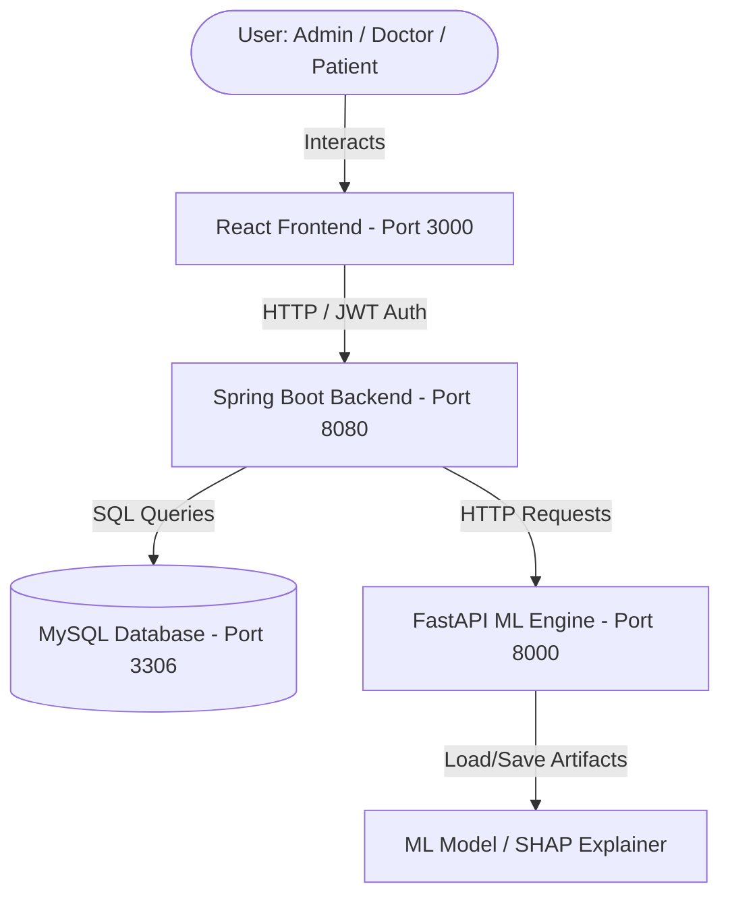

# Chronic Kidney Disease (CKD) AI Platform

An end-to-end clinical decision support platform designed to predict, track, and explain Chronic Kidney Disease (CKD) progression using Artificial Intelligence.

---

## 🚀 Project Overview

The **CKD AI Platform** is a multi-tier, clinical dashboard system designed for three categories of users: **Patients**, **Doctors**, and **Administrators**. It integrates a **Spring Boot** backend, an interactive **React** frontend, and a dedicated **FastAPI** Machine Learning service that utilizes an Artificial Neural Network (MLP) for staging and SHAP (Shapley Additive exPlanations) for explainable predictions.

---

## 🏗️ High-Level Architecture

The platform uses a microservices-style layout:
1. **Frontend (React)**: An interactive SPA built with React and Tailwind CSS, featuring role-based portals for Patients, Doctors, and Admins.
2. **Backend (Spring Boot)**: A RESTful API handling authentication (JWT), database operations, business logic, and chatbot integration.
3. **ML Service (FastAPI)**: A Python service providing inference, SHAP calculations, and automatic model retraining.



---

## 🌟 Core Features

### 1. Portals & Roles
* **Patient Portal**: Log lab measurements, view historical progression charts (using Recharts), access the AI medical chatbot, and view prediction results.
* **Doctor Portal**: Manage patient lists, log clinical records, view feature attribution (SHAP explanation) charts showing *why* the AI estimated a specific CKD risk level, and chat with patients.
* **Admin Portal**: Manage users, view application audit logs, trigger model retraining, and view system statistics.

### 2. Dual-Mode Clinical Chatbot
* **Patient Mode**: Answers questions about diets (potassium/sodium limits), symptoms (proteinuria, edema), and explains eGFR/ACR test reports.
* **Doctor Mode**: Provides mathematical detail on the MLP layers, SHAP calculations, and KDIGO staging guidelines.

---

## 🛠️ Technology Stack

* **Frontend**: React (Create React App), Tailwind CSS, Chart.js / Recharts, Lucide React, Axios.
* **Backend**: Java 17, Spring Boot 3.x, Spring Security (JWT), Hibernate/Spring Data JPA, Maven.
* **Machine Learning**: Python 3.10+, FastAPI, Uvicorn, Scikit-learn, Pandas, NumPy, SHAP.
* **Database**: MySQL.

---

## 📂 Project Structure

```
CKD/
├── frontend/          # React Web Application
├── backend/           # Spring Boot REST API
├── ml/                # FastAPI Machine Learning Service
└── project_report.md  # Detailed Project Report
```

---

## ⚙️ Getting Started & Setup

### 1. Prerequisites
* **Java**: JDK 17
* **Node.js**: v16+ & npm
* **Python**: v3.10+
* **Database**: MySQL Server

### 2. Setup ML Service (`ml`)
1. Navigate to the `ml/` directory.
2. Create and activate a Python virtual environment:
   ```bash
   python -m venv venv
   # On Windows
   .\venv\Scripts\activate
   # On macOS/Linux
   source venv/bin/activate
   ```
3. Install dependencies:
   ```bash
   pip install -r requirements.txt
   ```
4. Start the FastAPI server using Uvicorn:
   ```bash
   python main.py
   ```
   *The server runs on `http://127.0.0.1:8000`.*

### 3. Setup Backend (`backend`)
1. Navigate to the `backend/` directory.
2. Update the database credentials in `src/main/resources/application.yml` if necessary.
3. Build and run the Spring Boot application using Maven:
   ```bash
   mvn clean spring-boot:run
   ```
   *The server runs on `http://localhost:8080`.*

### 4. Setup Frontend (`frontend`)
1. Navigate to the `frontend/` directory.
2. Install the frontend dependencies:
   ```bash
   npm install
   ```
3. Start the React development server:
   ```bash
   npm start
   ```
   *The application will open automatically at `http://localhost:3000`.*

---

## 🔑 Default Credentials

The application automatically seeds default accounts upon backend startup:

* **Administrator**
  * **Username**: `admin`
  * **Password**: `admin123`
  * **Role**: `ROLE_ADMIN`

* **Doctor**
  * **Username**: `doctor`
  * **Password**: `doctor123`
  * **Role**: `ROLE_DOCTOR`

* **Demo User**
  * **Username**: `demo`
  * **Password**: `demo123`

* **Patients** (automatically created from dataset imports)
  * **Username**: `patient_0`, `patient_1`, `patient_2` ...
  * **Password**: `password123`
  * **Role**: `ROLE_PATIENT`
