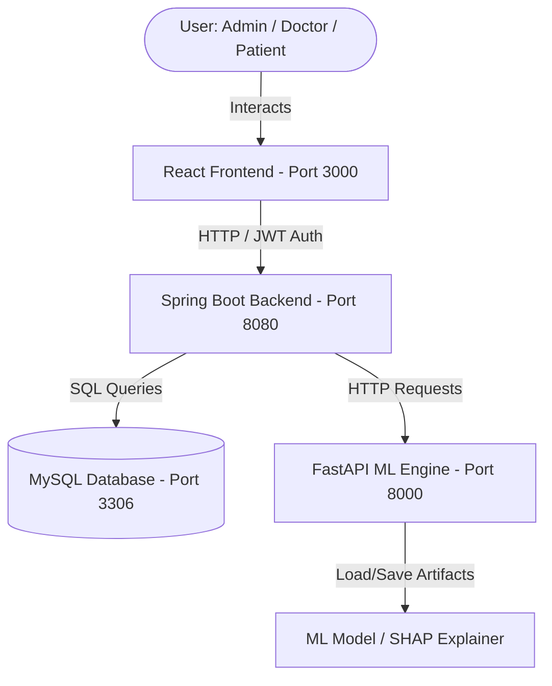

# Chronic Kidney Disease (CKD) Using Ml - Project Report

An end-to-end clinical decision support platform designed to predict, track, and explain Chronic Kidney Disease Stage Prediction using Machine Learning.

---

## 1. High-Level Architecture
The project utilizes a multi-tier, microservices-style architecture composed of:
1. **Frontend (React)**: An interactive SPA (Single Page Application) built with React and Tailwind CSS, featuring distinct portals for Patients, Doctors, and Administrators.
2. **Backend (Spring Boot)**: A Java-based RESTful API that handles user authentication (JWT), role-based authorization, database persistence (MySQL), and business logic.
3. **ML Service (FastAPI & Uvicorn)**: A Python-based inference engine that performs stage classification, risk prediction, SHAP (Shapley Additive exPlanations) calculation, and model retraining.

---

## 2. Core Service Modules

### A. Machine Learning Service (`ml`)
The ML component is responsible for analyzing clinical parameters, classifying the severity stage, estimating disease progression risks, and explaining model predictions.

* **ML Model**: Uses a **Random Forest Classifier** optimized through hyperparameter tuning with `GridSearchCV` trained on clinical datasets.
  * **Input Parameters (24 Features)**: Includes age, blood pressure, specific gravity, albumin, sugar, red blood cells, pus cell, pus cell clumps, bacteria, blood glucose random, blood urea, serum creatinine, sodium, potassium, hemoglobin, packed cell volume, white blood cell count, red blood cell count, hypertension, diabetes mellitus, coronary artery disease, appetite, peda edema, and anemia.
* **Explainability (SHAP)**: Uses *SHapley Additive exPlanations* (specifically `KernelExplainer` based on training samples) to calculate the positive or negative contribution of each patient feature toward their CKD risk score.
* **Model Retraining**: Built-in `/retrain` background worker that executes hyperparameter tuning and model packaging on demand when new patient records are registered.

### B. Spring Boot Backend (`backend`)
Responsible for data security, business rules, and service integration.
* **Security & Authentication**: Implements Spring Security with JSON Web Tokens (JWT).
* **Database Access**: Uses Hibernate/Spring Data JPA to interact with MySQL.
* **Dual-Mode Clinical Chatbot**: A smart virtual assistant with two knowledge bases:
  * **Patient Mode**: Focuses on diet restrictions (potassium, sodium limits), explaining symptoms (proteinuria/foamy urine, edema), and clarifying eGFR/ACR test reports.
  * **Doctor Mode**: Focuses on explainable Random Forest decision boundaries, SHAP calculations, and KDIGO (Kidney Disease: Improving Global Outcomes) staging standards.
* **Direct Messaging System**: Allows secure, cross-portal chat logs between patients and doctors.

### C. React Frontend (`frontend`)
Constructed with role-based dashboard views:

| Portal | Core Features |
| :--- | :--- |
| **Patient Portal** | Self-input lab measurements, historical progression logs, GFR/risk charting (using Recharts/Chart.js), AI medical chatbot assistant. |
| **Doctor Portal** | Patient management dashboard, clinical value entry forms, SHAP feature attribution graphs showing *why* the AI estimated a specific risk level, and a patient direct messenger. |
| **Admin Portal** | User account management, application auditing, logs explorer, ML retraining triggers, and overall portal statistics. |

---

## 3. Database Schema Overview
The MySQL database (`ckd_db`) contains the following primary tables:

1. **`users`**: Stores authentication records (username, email, password, profile picture, password reset tokens).
2. **`roles`**: Contains security privileges (`ROLE_PATIENT`, `ROLE_DOCTOR`, `ROLE_ADMIN`).
3. **`user_roles`**: Many-to-many relationship mapping table.
4. **`patient_profiles`**: Clinical demographics linked to patient users (blood group, address, age, contact number).
5. **`lab_records`**: Stores historical clinical measurement logs (creatinine, hemoglobin, blood pressure, etc.) used to query AI predictions.
6. **`chatbot_logs`**: Logs all messages, intent classifications, chatbot responses, and doctor-patient direct messages.
7. **`retraining_logs`**: Keeps track of when the ML model was retrained, who triggered it, and the resulting F1-score/accuracy adjustments.

---

## 4. Default System Users
Upon startup, the backend automatically bootstraps the database with default accounts if they do not exist:

* **Administrator**:
  * **Username**: `admin`
  * **Password**: `admin123`
* **Demo Doctor / Patient**:
  * **Username**: `demo`
  * **Password**: `demo123`

---

## 5. Development Tools & Technologies
* **Frontend**: React (Create React App), Tailwind CSS, Lucide React icons, Axios, Chart.js/Recharts.
* **Backend**: Java 17, Spring Boot 3.x, Spring Security, Hibernate, MySQL Connector, Maven.
* **Machine Learning**: Python 3.10+, FastAPI, Uvicorn, Pandas, NumPy, Scikit-learn, SHAP, Pydantic.
